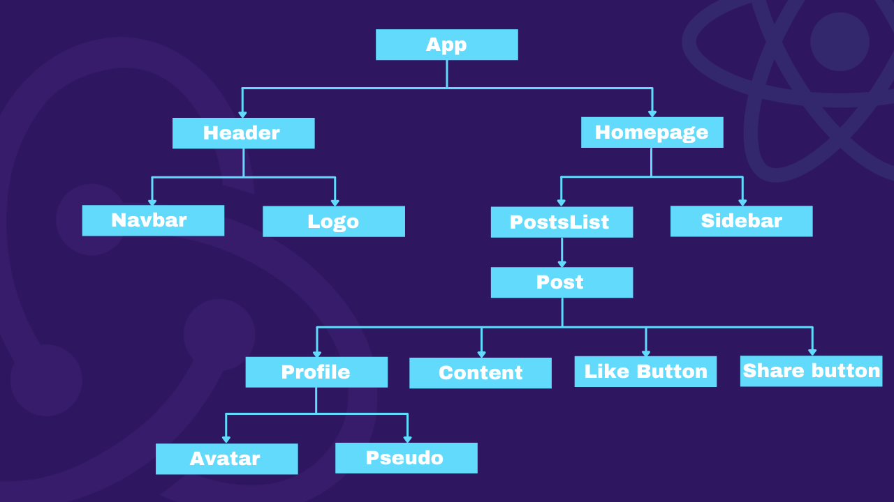

<!-- Aujourd'hui nous allons découvrir la librairie de State management Redux et de l'implémenter dans un projet React. -->
<!--truncate-->

---

## Prérequis

* Javascript ES6

* Les bases de React et les Hooks

## Préçision

Cet article se complète avec ma mini formation Youtube portant sur le même sujet. Ces vidéos vous permettront d'aborder le sujet en profondeur car je trouve que les vidéos Youtube sont plus digestes et me permettent de développer davantages mes explications et de mieux rentrer dans les détails.

## Introduction

Si vous êtes déjà familier avec React, vous connaissez forcément le principe de props et de state. En effet, React nous permet d'utliser des state locales dans notre application grâce au hook `useState()`.

Vous avez sûrement déjà été confronté à ce genre de situation où vous faîtes passer vos states de props en props à travers tout l'arbre de component. 

Je m'explique, imaginez avoir une application React avec la même architecture que ci-dessous :



Maintenant, je crée un state qui se nomme `users` dans mon composant `Homepage` et j'aimerai l'utiliser dans le composant enfant `PostsList`. 

Pour ce faire, il me suffit juste à passer mon state `users` en props de `PostsList` comme ceci : 
```javascript {8}
const HomePage = () => {
    const [users] = useState([
        { id: 1, name: 'Louis' },
        { id: 2, name: 'Paul' },
        { id: 3, name: 'Nicolas' }
    ]);
    return (
        <PostsList users={users}/>
        <Sidebar />
    );
};
```
Voilà à quoi cela ressemble au niveau de l'arbre de composants. Ici on ne descend que d'un cran, on part de `HomePage` qui est notre point A jusqu'à `PostsList` qui est notre point B. Jusque là tout va bien.


À présent, admettons que nous ayons besoin d'utiliser notre state `users` dans le composant `Avatar`, notre arbre des composants ressemblera à ceci : 


Je pars donc bien de `HomePage` qui est mon point A vers `Avatar` qui est mon point B. Là c'est une toute autre histoire. Nous sommes forcés de descendre de 4 cran dans l'abre des composants.
Nous aurons certe un application fonctionnelle, qui marche mais nous pouvons être confrontés à différents soucis.

Nous pouvons voir que notre state `users` passe en props de 3 components différents (ici en Jaune) dans lesquels notre state n'est même pas consomé, on y perd en lisibilité et cela rend ces mêmes composants d'autant plus verbeux.

Si ce genre de comportement est ponctuelle dans votre application, cela peut aller mais dans le cas où vous vous retrouvez avec des states venant de 4 voir 5 crans au dessus un peu partout dans votre application, cela peut devenir très très difficile à débugger. 
En effet, on peut être amené à des situation où il est compliqué de savoir dans quel component a été crée quel state ou même se poser la question suivante : "Qu'est ce qui a fait changer mon state ?".


Maintenant, que feriez vous si aviez un state dans votre component `Pseudo` (point A) et que vous deviez l'utliser (donc le remonter) dans le component `Navbar` (point B) ?


Alors là bon courage, remonter un state qui se trouve tout en bas de l'abre des composants et le faire remonter tout en haut (en passant par `App`) risque d'être très fastidieux. Et encore espèrons que cela n'arrive qu'une fois dans votre application. 

Faire du `Lifting State Up` (remonter un state au parent) peut être fait ponctuellement, mais si cela se fait à la chaine et ceci plusieurs fois, vous risquez donc d'avoir un code peu lisible, compliqué à débugger et difficile à maintenir... Et c'est là qu'intervient `Redux` ! 


## Qu'est ce que Redux ?

Redux est une librairie JavaScript développée par Dan Abramov vous permettant de gérer et de stocker les différents states de votre application. Ces states seront modifiés à travers d'éléments appelés `actions`. Voyez Redux comme étant une "mini base de donées front" qui permet à votre application d'avoir accès à un `store` global.

Attention ! Beaucoup pensent que Redux est une librairie propre à React (faut dire que les deux logos partagent beaucoup de similitudes). Comme dit plus haut, Redux est une librairie JavaScript et peut donc être utilisée aussi bien en React qu'en Angular, VueJS, Svelte ou même avec du vanilla JS.


## Les 3 principes fondamentaux ?

Redux peut se définir à travers 3 grands principes qui régissent la philosophie de la librairie. J'aimerai que vous reteniez ces 3 principes car ils sont assez explicits et qu'ils vous permettent de garder à l'esprit toute la philosophie de Redux.


### Single source of truth

C'est à dire que le state global de notre application sera stocké dans un `store` unique, qui sera bien souvent un objet JavaScript. Avoir un seul state global permet à l'application d'être facilement débuggable. Je vous recommande d'ailleurs d'installer l'extension Chrome s'intitulant `Redux Devtools`vous permettant d'avoir une meilleure vision du store et revenir en arrière pour voir les différents changements qui y ont été effectués.

Voici un exemple d'un `store` Redux.
```javascript
{
  isDarkMode: false,
  books: [
    {
      title: 'Naruto',
      auteur: 'Kishimoto',
    },
    {
      title: 'Central Park',
      auteur: 'Guillaume Musso',
    },
  ]
  todos: [
    {
      title: 'Apprendre Redux',
      completed: true,
    },
    {
      text: 'Vous abonner à la chaîne Youtube ProLyfe;',
      completed: false,
    },
  ]
}
```

Ici on peut voir que notre store possède 3 states différents :
* isDarkMode
* books
* todos

En React vanilla, nous aurions déclaré ces states comme ceci : 

```javascript
const [isDarkMode, setIsDarkMode] = useState(false);

const [books, setBooks] = useState([
    {
      title: 'Naruto',
      auteur: 'Kishimoto',
    },
    {
      title: 'Central Park',
      auteur: 'Guillaume Musso',
    },
]);

const [todos, setTodos] = useState([
    {
      title: 'Apprendre Redux',
      completed: true,
    },
    {
      text: 'Vous abonner à la chaîne Youtube ProLyfe;',
      completed: false,
    },
]);
```
Grâce au `store`, les states qui s'y trouvent peuvent être utilisés dans toute notre application.


### State is readonly

Ok très bien. Nous avons vu que Redux possède un `store` qui représente le state global de notre application. Cependant, notre state reste en readonly ! Cela permet d'éviter que la view ou les différentes fonctions callbacks modifient directement notre state par erreur.
La SEULE façon de changer les states du `store` est d'émettre une `action` qui n'est rien de plus qu'un objet JavaScript qui décrit le type de l'action.

Pour illustrer ce principe voici deux petites scenettes qui se situent dans un bar tabac :


Ici l'utilisateur modifie directement notre state qui n'est pas du tout sécurisé. Il deviendra alors très difficile de déterminer qui a prit quoi et combien.

Passons dans le cas d'un state en readonly comme Redux : 


Notre `store`est ici protégé et l'utilisateur ne peux pas intéragir directement avec notre state.
Il doit alors émettre une action, ici de type 'BUY_CIGARET' et c'est seulement après l'`action` reçue et validée par le buraliste que notre store va pouvoir changer.

Rappelez vous, les `actions` sont tout simplement des objets JavaScript et peuvent donc être facilement testables, loggés ou même replay (en partie grâce au Redux Devtools extension).
Nous rentrerons plus en détail sur les `actions` un peu plus tard.

Maintenant à la fameuse question "Mais qu'est ce qui a modifié ce state ?!", vous pourrez répondre "Regarde quelles actions ont été émises et tu sauras ;)". 


### Changes are made with pure functions